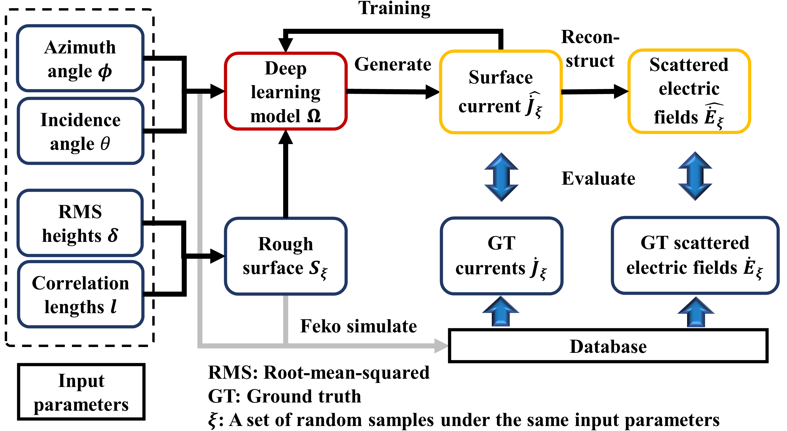

# A Deep Learning Based Surface Current Generation Method for Scattering Modeling at Terahertz Band



=================================================================================

## Background
### present
As frequencies extend to millimeter-wave and beyond, scattering becomes aprominent propagation mechanism, especially for short-range applications. The scattering characterization in both the near and far field
is momentous for realizing a wide range of applications, such as terrestrial and ultra-short-range communication. A unified modelling approach can effectively avoid boundary effects for link-level 
electromagnetic calculation systems such as ray tracing. This paper proposes a deep learning model based on modulated convolution neural networks (McnNet) to generate surface currents (SC) initially induced by the incident wave.

### our contribution
• Massive simulation on rough surfaces by MLFMM was conducted. Input parameters with 16 incidence angles (θ), 8 azimuth angles (ϕ), 14 correlation lengths (l) and 14 root mean square heights (δ) under two kinds of radiation
sources are cross-configured and simulated.

• A novel modulated convolution neural network (McnNet)is developed for SC generation. Modulated convolution layers are extensively adopted to incorporate different input parameters. Heuristic multidimensional loss function
and optimization strategies are used to enhance the fitting performance and robustness of the model.

• The scattered electric field is reconstructed based on SC, not only realizing high-precision modeling for near and far field scattering but also obtaining scattering characteristics at the THz band from an intrinsical perspective.


## Install
This project uses [Anaconda](https://www.anaconda.com/) and [PyTorch](https://pytorch.org/)  . Go check them out if you don't have them locally installed.

```
pip3 install torch torchvision torchaudio --extra-index-url https://download.pytorch.org/whl/cu113
```

All the model and demos are based on the PyTorch(1.8.1+cu101) and CUDA(10.1). Please check whether your build version is correct before running this project. **Both Windows and Linux can make it through**.

## Usage
You can download the code above, we'd recommend you download zip to develop the project.

You can run the project with the following command statement.

```
python main.py
```
## Dataset
Workers can use [FEKO] to build your dataset.

## Contributing
### Contributors

This project exists thanks to all the people who contribute.

## Article
[A Deep Learning Based Surface Current Generation Method for Scattering Modeling at Terahertz Band](https://arxiv.org/abs/2301.)
